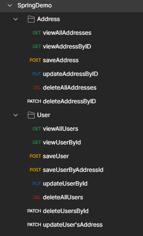
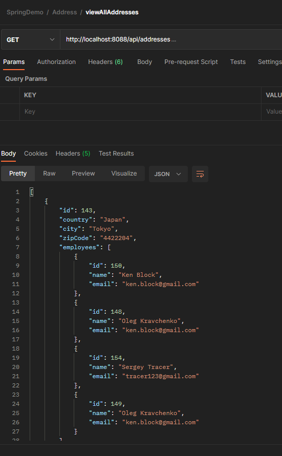

### Demo spring Boot application

---

### :robot: Technologies used in the application:

    Spring Boot, Spring Data, Hibernate, PostgreSQL

    As client - Postman

---
### 	:computer: How to start application?

1. Make a fork from this project or clone repository.

2. Build this application using Maven.

>mvn clean install

3. Make sure your PostgreSQL database is running and db 'machines' is created!
4. Run .jar file.

>java -jar demoSpringBoot-0.0.1-SNAPSHOT.jar

---

Request collection for Postman
> https://www.getpostman.com/collections/4a81b0df8d6b174d5c35

### Requests

 #### Example of GET requests to get all addresses

